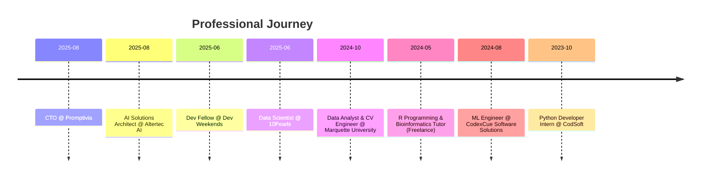

<!-- Profile Banner -->

  

---

# 👋 Hey, I’m Zain  

**CTO @ Promptivia | AI Solutions Architect @ Altertec AI | Fellow @ Dev Weekends**  
Full-Stack Engineer ⚡ Machine Learning Enthusiast ⚡ Vision Beyond Pixels  

📍 Islamabad, Pakistan  
📧 [Email](mailto:officialmuhammadzain45@gmail.com)  

---

## 🌐 Connect With Me  

 

---

## 🌟 About Me  

> Shifted a button 2px left and triggered a cascade of neural curiosity.  
> Bootstrapped from pixels to pipelines, blending **full-stack logic with computer vision dreams**, stitched together by **transformers whispering in matrix math**.  

I build intelligent systems **not just because they’re needed, but because they *could exist***.  

---

## 🛠 Skills & Tech  

  <!-- Skillicons supported -->
  

  

---

## 📜 Certifications  

✅ Intermediate SQL from Datacamp
✅ Docker from Datacamp
✅ Python Crash Course from Google 
✅ Learn R from FreeCodecamp 

## 💼 Experience Timeline  

## 🎓 Education  

🎓 **Iqra University (Official)** – BSc, Computer Science *(2023 – 2027)*  
🏫 **Jamia Millia Govt Degree College** – Intermediate, Computer Science *(2021 – 2022)*  
📘 **Maple Grammar School** – Matriculation, Computer Science *(2019 – 2020)*  

---

## 📚 Publications  

✍️ *How I Built NeuroShell — An AI-Powered Terminal That Understands You*  

---

## 📊 GitHub Stats  

 
   
   

---

## ⚡ Fun Fact  

☕ Caffeine-fueled deployments.  
🔍 Debugging reality through layers dense and otherwise.  
💡 Building systems that blur the line between imagination and execution.  

---

<!-- Footer Banner --> 

 
   

